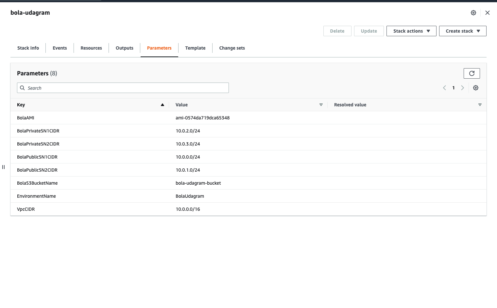
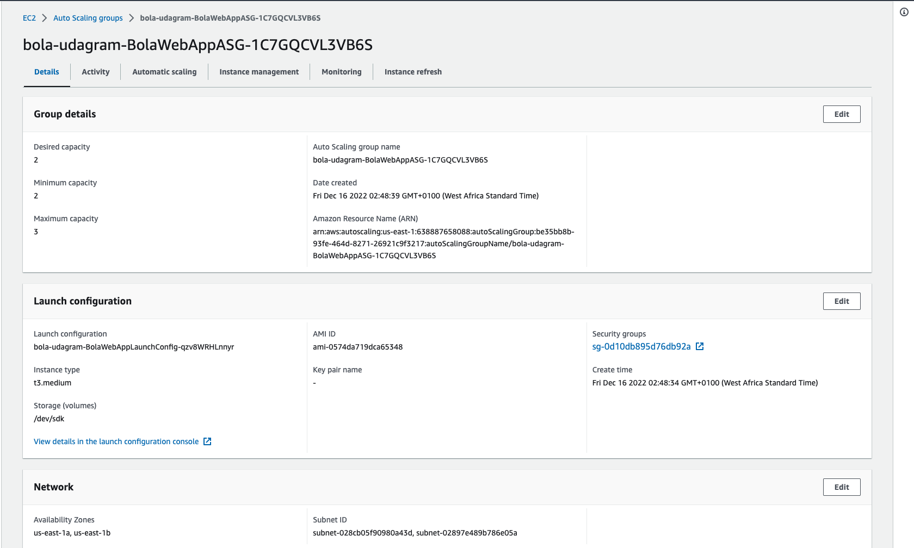
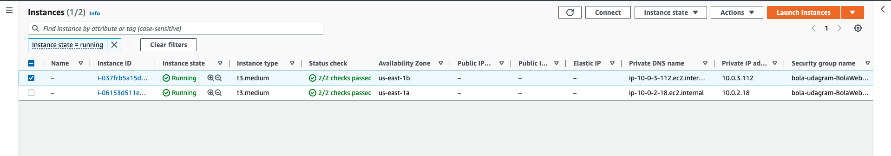
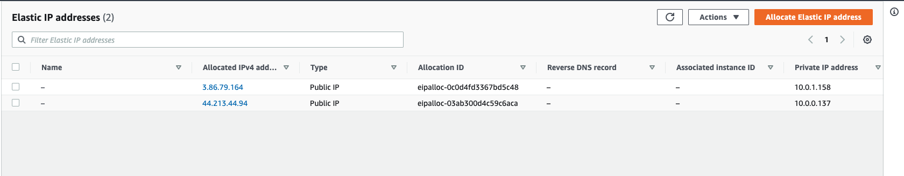
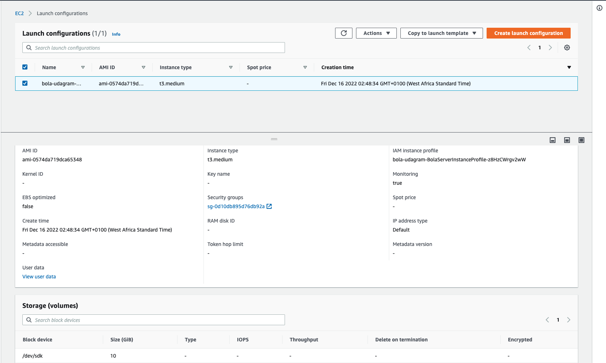
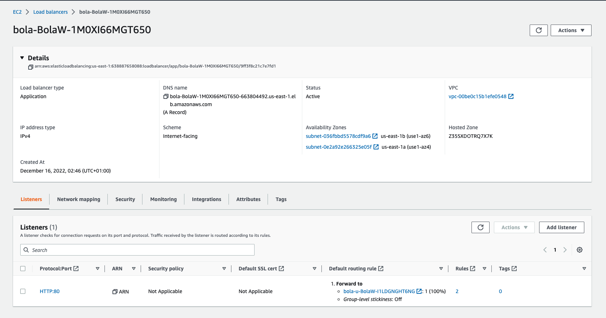
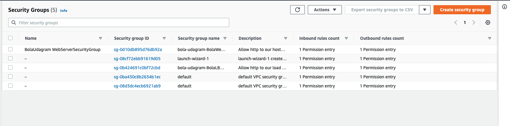
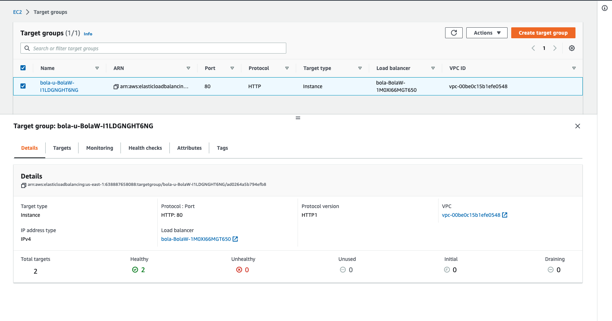
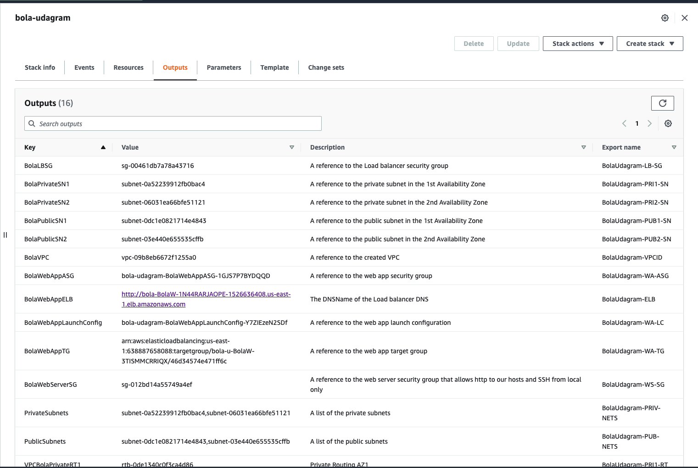
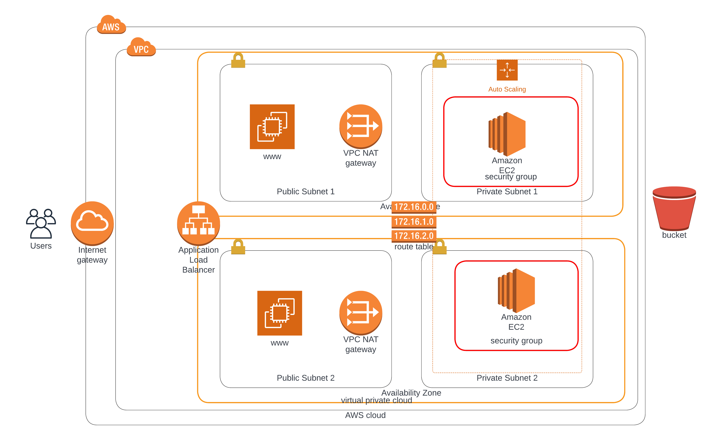

# Deploy a high-availability web app using CloudFormation

## SPECIFICATIONS

### Working Test

_Note that the script has been modified to access the web page from a S3 bucket_

The files used were taken from [an old project, available on Github](https://github.com/bolah2009/js-ttt).

- S3 bucket - http://bola-udagram-bucket.s3-website-us-east-1.amazonaws.com
- Load Balancer URL - http://bola-BolaW-1M0XI66MGT650-663804492.us-east-1.elb.amazonaws.com

### Parameters

The parameters can be found on the script as shown before from the cloudformation page.

### AutoScalingGroup

### EC2Instances

### ElasticIPs

### LauchConfiguration

### LoadBalancers

### SecurityGroup

### TargetGroups

### Outputs

### WebApp Diagram

